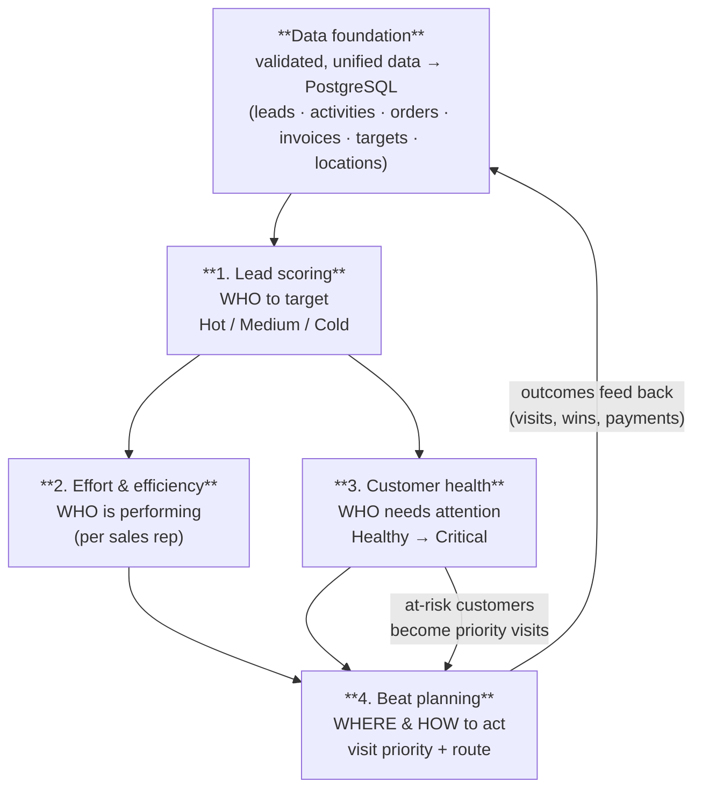

# AI Intelligence — Features Specification

**Status:** analysis & design (pre-build). **Audience:** product, business
stakeholders, and engineers scoping the intelligence layer.
**Purpose:** the *what* and *why* — every intelligence feature, its exact
formula, classification bands, and what the user sees.

**Source of truth for requirements:** JSPL CRM-AI business documentation
(`JSPL - AI CRM/01. Documentation/01. From JSPL/`) — the Lead Scoring,
Effort & Efficiency, Customer Health, Beat Plan, Dashboard BRDs, the scoring
diagrams (`02. Self/01. Scoring Images/`), and `CRM AI - ADR-001.pdf`.

**Engineering counterparts (already in this repo):**
- `INTELLIGENCE_SPECIFICATION.md` — the authoritative, formula-exact internal
  design (bands, defaults, config JSON, worked examples). **This Features doc
  summarises it for a business audience; that file is the source of truth for
  any numeric disagreement.**
- `AI_Intelligence_Implementation.md` — the phase-wise build plan (TDD).
- `AI_Intelligence_Integration.md` — how it plugs into the existing app + Zoho.

> **A note on numbers.** Where the JSPL documents are explicit (e.g. lead
> scoring tables, health weights, beat weights), we adopt them verbatim. Where
> a document left a gap (budget tier thresholds, the normalization "period",
> a missing-data default), this spec adopts the calibrated value recorded in
> `INTELLIGENCE_SPECIFICATION.md` and marks it **[calibrated — confirm with
> business]**. Every weight and band is **configuration**, not code, so any of
> these can change without a redeploy.

---

## 1. The vision — a closed-loop sales execution system

The intelligence layer turns the inventory app's raw operational data
(customers, orders, stock, and newly-captured sales activity) into four
deterministic decision engines that answer one question each, and feed each
other in a loop:



*(Mirrors `02. Self/01. Scoring Images/1_crm_ai_overview.png`.)*

**Why "closed-loop":** beat planning consumes lead scores + health + effort to
decide today's visits; those visits generate activities, wins, and payments;
those refresh the scores tomorrow. Nothing is a dead-end report.

### 1.1 Design principles (non-negotiable — from ADR-001 + our spec)

| # | Principle | Why it matters |
|---|---|---|
| 1 | **Deterministic first.** Every score is pure arithmetic over stored data — same inputs ⇒ same output, testable to the decimal. | Demoable and trustable without any AI/LLM cost or nondeterminism. |
| 2 | **Weights live in configuration, never in code.** Each engine reads its active `scoring_configs` row. | "Margin is now 25%, not 20%" is a data change, not a deploy (ADR-001). |
| 3 | **Every score is versioned.** Each persisted score records the config version that produced it. | A/B testing and audit (ADR-001 "log framework version with each score"). |
| 4 | **Missing data never blocks scoring.** Every parameter has a conservative default; the score records which defaults it used. | A lead with only a name still scores (JSPL lead-scoring principle). |
| 5 | **Score history is append-only.** Snapshots are inserted, never updated — like the existing `stock_movements` ledger. | Trends come for free; full auditability. |
| 6 | **AI/LLM is additive, never authoritative.** The LLM (Phase 2D) writes narrative summaries and an *optional* qualitative lead sub-score; it never silently mutates a deterministic score. | Reproducibility and explainability. |

---

## 2. Feature 1 — Lead Scoring ("who to target")

**What it does:** scores every lead 0–100 and labels it **HOT / MEDIUM /
COLD** so reps work the right leads first. Five parameters, equally weighted
at **20%** each. *(Source: `Lead Scoring – Parameters & Calculation.docx`,
`2_lead_scoring.png`.)*

```
final_score = 0.20·urgency + 0.20·location + 0.20·contribution_margin
            + 0.20·quantity + 0.20·product_margin

HOT ≥ 80   |   MEDIUM 40–79   |   COLD < 40
```

| Parameter | Business meaning | Derived from | Score table |
|---|---|---|---|
| **Urgency** | How soon the order will materialise | `required_by_date − today` | `<7d → 100 · 7–30d → 70 · 31–60d → 40 · >60d → 20` |
| **Location / serviceability** | Can we actually serve it | structured location (state→district→city/pincode) | `full → 100 · partial → 50 · state-only → 30 · none → 0` |
| **Contribution margin** | Expected profitability | `estimated_budget` + `dealer_potential` | tiered HIGH/MEDIUM/LOW → `100 / 70 / 40` (matrix; **[calibrated]** budget tiers) |
| **Quantity** | Order size, **normalised** to the period's largest lead = 100% | `quantity ÷ cohort_max` | `≥0.75 → 100 · 0.40–0.74 → 70 · 0.15–0.39 → 40 · <0.15 → 20` |
| **Product margin** | Product-level profitability | `(unit_price − standard_cost)/unit_price` | `≥25% → 100 · 10–24% → 60 · <10% → 30` |

**Worked example (canonical vector LS-1):** required in 20 days (70) ·
state+district only (50) · budget 800k + HIGH potential (70) · qty 50 of
cohort-max 60 → ratio 0.83 (100) · item margin 16% (60) →
`0.2·(70+50+70+100+60) = 70.0 → MEDIUM`.

**What the user sees:** a HOT/MEDIUM/COLD badge on every lead row; a detail
panel with the five parameter bars and a "defaults applied" note when data was
missing; the funnel (NEW → QUALIFICATION → NEGOTIATION → WON/LOST).

> **ADR-001 nuance (production):** JSPL mandates **BU-specific frameworks** —
> Cement (predictive, 100 pts incl. 15 LLM pts) vs TMT (qualification, incl.
> 20 LLM pts), because Cement converts ~26% but TMT ~0%. The POC ships **one**
> framework; the config + versioning schema makes a second framework a new
> config row + a routing rule, not a redesign.

---

## 3. Feature 2 — Effort & Efficiency ("who is performing")

**What it does:** per sales rep, measures **effort invested** and **output
per unit of effort**, and places each rep in a 2×2 action matrix. *(Source:
`Effort_and_Efficiency_…Version 1.3.docx`, `3_effort_efficiency.png`.)*

### 3.1 Effort score (input invested)

```
effort_raw = (visits × 3) + (meetings × 4) + (follow_ups × 2) + (calls × 1)
           + time_spent_weight            (1 point per hour logged)
effort_score = effort_raw ÷ (max effort_raw across reps in period) × 100
```
Top performer = 100 by construction (peer-relative normalisation).

### 3.2 Composite efficiency score (5 components × 20% each)

| Component | Formula |
|---|---|
| Lead stage-change rate % | leads with ≥1 stage change ÷ leads assigned |
| Lead won rate % | leads won ÷ leads assigned |
| Revenue efficiency | Σ won-value ÷ effort_raw (then normalised) |
| Avg time-to-close | Σ(won_at − first_contact) ÷ leads won (**inverted** — faster is better) |
| Lead-score utilisation % | effort spent on HOT leads ÷ total effort |

```
efficiency = 0.20·(stage_change + won_rate + revenue_eff + time_to_close + score_util)

80–100 highly efficient · 60–79 efficient · 40–59 needs improvement · <40 inefficient
```

### 3.3 The action matrix (the actual feature output)

| | High efficiency | Low efficiency |
|---|---|---|
| **High effort** | Best performers — protect & reward | Process / targeting issue — coach |
| **Low effort** | Low engagement — needs a push | Underperformance — intervene |

**What the user sees:** an effort-vs-efficiency scatter (one dot per rep,
coloured by quadrant), a per-rep drill-down with the five components, and a
leaderboard. Manager-facing.

---

## 4. Feature 3 — Customer Health ("who needs attention")

**What it does:** scores every customer 0–100 as **performance minus churn
risk** and labels them **HEALTHY / STABLE / AT-RISK / CRITICAL**, so reps and
managers see who is slipping *before* they churn. *(Source:
`Customer_Health_Management_BRD Version 1.2.docx` + Cement appendix,
`4_customer_health.png`.)*

```
health = (CPS × W_P) − (CRS × W_R)      with W_P + W_R = 1, normalised to 0–100
HEALTHY 80–100 · STABLE 60–79 · AT-RISK 40–59 · CRITICAL < 40
```

### 4.1 Customer Performance Score (CPS) — higher is better

| Component | Weight | Measures |
|---|---|---|
| Volume achievement | 30% | dispatch ÷ target |
| Payment discipline (DSO) | 20% | days-sales-outstanding ageing |
| Engagement | 20% | visit + meeting frequency |
| Growth trend | 15% | revenue this period vs prior |
| Margin quality | 15% | realised margin % |

### 4.2 Churn Risk Score (CRS) — higher is riskier

| Component | Weight | Measures |
|---|---|---|
| Volume decline (30/60/90d) | 30% | drop vs trailing baseline |
| Payment risk / overdue | 25% | overdue ÷ total outstanding |
| Competitive risk | 20% | manual flag (NONE/LOW/MED/HIGH) **[POC]** |
| Engagement gap | 15% | `comm_gap × 0.4 + activity_gap × 0.6` |
| Service risk | 10% | open complaints |

**Engagement-gap sub-tables** *(JSPL canonical)* — communication gap (days
since last interaction): `0–7→0 · 8–15→20 · 16–30→40 · 31–60→70 · >60→100`;
activity gap (days since last transaction): `0–15→0 · 16–30→25 · 31–60→50 ·
61–90→75 · >90→100`.

### 4.3 Dynamic weight profiles by market *(JSPL)*

| Profile | W_P | W_R | Use |
|---|---|---|---|
| High-competition / **standard (default)** | 0.60 | 0.40 | default |
| Credit-stress market | 0.55 | 0.45 | payment risk matters more |
| Growth / expansion | 0.70 | 0.30 | performance matters more |

**What the user sees:** classification chips, a sortable health table, a detail
drawer with the CPS-vs-CRS breakdown and a trend sparkline (from snapshots),
and an action per status (Healthy → upsell, At-risk → AM intervention, Critical
→ retention workflow).

---

## 5. Feature 4 — Beat Planning & route optimisation ("where & how to act")

**What it does:** for a given rep, ranks their customers by a **Visit Priority
Score (VPS)**, clusters them by location, and proposes a day's beat within the
rep's visit capacity. *(Source: `Beat Plan BRD.docx`, `5_beat_planning.png`.)*

```
VPS = (0.35 × revenue_score) + (0.25 × visit_gap_score)
    + (0.20 × customer_type_score) + (0.20 × location_density_score)

CRITICAL ≥ 80 · HIGH 60–79 · MEDIUM 40–59 · LOW < 40
```

| Input | Definition |
|---|---|
| Revenue opportunity | `Visit Qty × Area MRP` (or 90-day revenue), normalised 0–100 |
| Visit gap | days since last visit: `<15→25 · 15–29→50 · 30–44→75 · ≥45 → 100` |
| Customer type weight | DEALER 100 · SUB-DEALER 80 · RETAILER 70 |
| Location density (LDS) | customers in same district ÷ rep's total customers; **LDS > 0.50 = cluster opportunity** |

**Productivity layer (reported KPIs):** daily visit efficiency = completed ÷
planned; time utilisation against a **16 visits/day** ceiling (360 effective
min ÷ ~22 min/visit); revenue per visit; beat efficiency =
`0.30·cluster + 0.30·revenue + 0.20·completion + 0.20·time_util`.

**Success KPIs (before → after AI, JSPL targets):** visits/day 5 → 8–12;
revenue/visit +20%; time utilisation <40% → >70%; beat efficiency NA → ≥75.

**What the user sees:** a rep selector, a ranked visit list with the VPS
breakdown and priority band, cluster grouping by district, and a suggested
beat (top ~12 customers).

> **Reconciliation note:** the `KPIs Used.docx` defines an alternative 5-factor
> *LVPS* (`0.30 lead-score + 0.25 ROS + 0.20 visit-gap + 0.15 LDS + 0.10
> visit-type`). We adopt the **Beat Plan BRD's 4-factor VPS** (the dedicated,
> self-consistent, newer doc); the LVPS variant is reachable later as a config
> version. *(Decision D-2 in `INTELLIGENCE_SPECIFICATION.md`.)*

---

## 6. Supporting features

### 6.1 Dashboards & KPIs (role-based)
A role-based analytics layer (Sales Officer → Manager → Leadership) with
cross-filtering on time / region / BU / product / customer-type / owner /
source. Surfaces lead funnel & velocity, beat adherence, sales vs target,
credit & overdue ageing, and the four engine outputs. *(Source:
`Dashboard_Module_BRD.docx`, `KPIs Used.docx`, `KPI_Permutations…docx`.)*

### 6.2 Customer Docket / 360 view
A per-customer profile combining identity, commercial performance,
branch-wise volume, financial/credit posture, behavioural engagement, and the
churn-analysis tab (health score). ~55–60% of fields are available from
existing data today; the rest (competitor intel, decision-makers, future
plans) are flagged as new modules. *(Source: `Customer Docket BRD v1.1`,
`customer_profile_feasibility.docx`.)*

### 6.3 AI Business Summary (LLM — Phase 2D)
A natural-language summary per customer/lead, generated **over the
deterministic outputs** (scores, trends, activity notes, invoice posture) —
e.g. *"This dealer's health dropped to AT-RISK: dispatch down 32% over 60 days
and ₹4.2L overdue; last visit 41 days ago. Suggested action: …"*. Plus an
**optional qualitative lead sub-score** (ADR-001 allocates 15–20 pts).
**Hosted on a free LLM endpoint (OpenRouter / Groq), temperature 0, grounded
only in retrieved records, JSON-schema-validated.** Never mutates deterministic
scores. *(See `AI_Intelligence_Implementation.md` §LLM.)*

---

## 7. Sales tracking — where the activity data comes from

The effort/efficiency, engagement, visit-gap and communication-gap features
all need **sales activity** (visits, calls, meetings, follow-ups). There are
two complementary sources, and the design supports both:

| Source | What it provides | Status |
|---|---|---|
| **Our app (canonical)** | `sales_activities` table — reps log visits/calls/meetings/follow-ups; append-only, like the stock ledger. | Phase 2A (built first — no external dependency). |
| **Zoho CRM (relationship layer)** | Tasks / Calls / Meetings / Notes that field reps already log on the Zoho mobile app, against Accounts. | Phase 2E — pulled in via the Integration Layer (see Integration doc). |

**Recommendation:** our app owns the canonical activity store (so scoring works
standalone and deterministically); Zoho is an **additional ingest source** for
field-logged activity, synced in via the Integration Layer. This honours the
existing build order (Integration Layer last) and the one-way Phase-1 Zoho
contract, while letting "sales tracking via Zoho" feed the engines in
production. *(Details + options in `AI_Intelligence_Integration.md` §Zoho.)*

---

## 8. What's deliberately out of scope (this phase)

- **ML / predictive models** — everything is deterministic by design; the LLM
  is narrative-only.
- **Role-hierarchy dashboards** (CEO/NSM/RM views) — POC has admin + rep.
- **Geocoding / lat-lon route optimisation** — clustering is district-based.
- **BU-specific (Cement/TMT) frameworks** — single framework; config-ready.
- **Two-way Zoho sync of business state** — Zoho stays a visibility/ingest
  layer, not a source of truth for stock/orders.

---

## 9. Feature → data dependency map (readiness)

| Feature | Needs (new data) | Available now in app? | Gap / mitigation |
|---|---|---|---|
| Lead scoring | leads, `standard_cost`, structured location | ❌ leads are new | Phase 2A builds `leads`; cost is a nullable column with a default-path |
| Effort & efficiency | sales activities, lead outcomes, won-value | ❌ activities are new | Phase 2A `sales_activities`; optional Zoho ingest later |
| Customer health | targets, invoices/payments, dispatch (orders), activities | ⚠️ partial | orders exist; Phase 2A adds targets + invoices/payments |
| Beat planning | customer type, location, revenue, visits | ⚠️ partial | Phase 2A adds `customer_type` + structured location |
| LLM summary | all of the above + remarks | ❌ | Phase 2D; free LLM key |

**Known JSPL data gaps (flagged by analysis, handled by config/defaults):**
Area-MRP master (beat revenue), competitor data (manual flag for now),
W_P/W_R calibration (config defaults), lead-score budget tiers (config),
quantity-normalisation period (config = 90 days). None block the build; each
has a documented conservative default.

---

*Continue to `AI_Intelligence_Implementation.md` for the phase-wise build plan,
and `AI_Intelligence_Integration.md` for how this lands in the existing
codebase and Zoho.*
