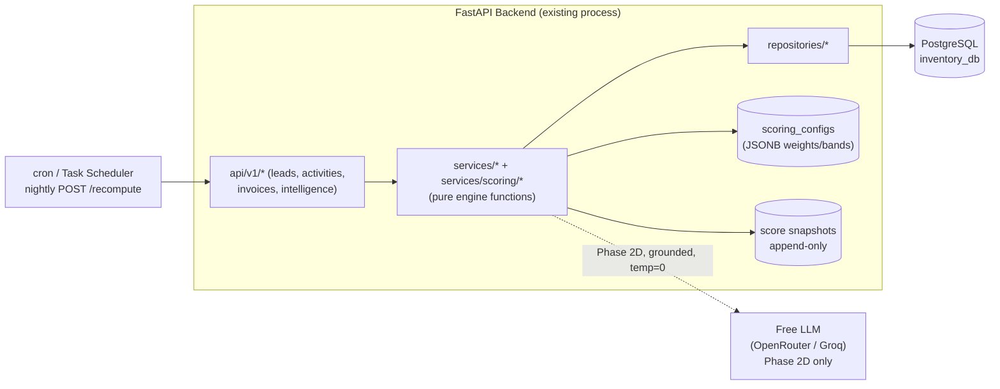
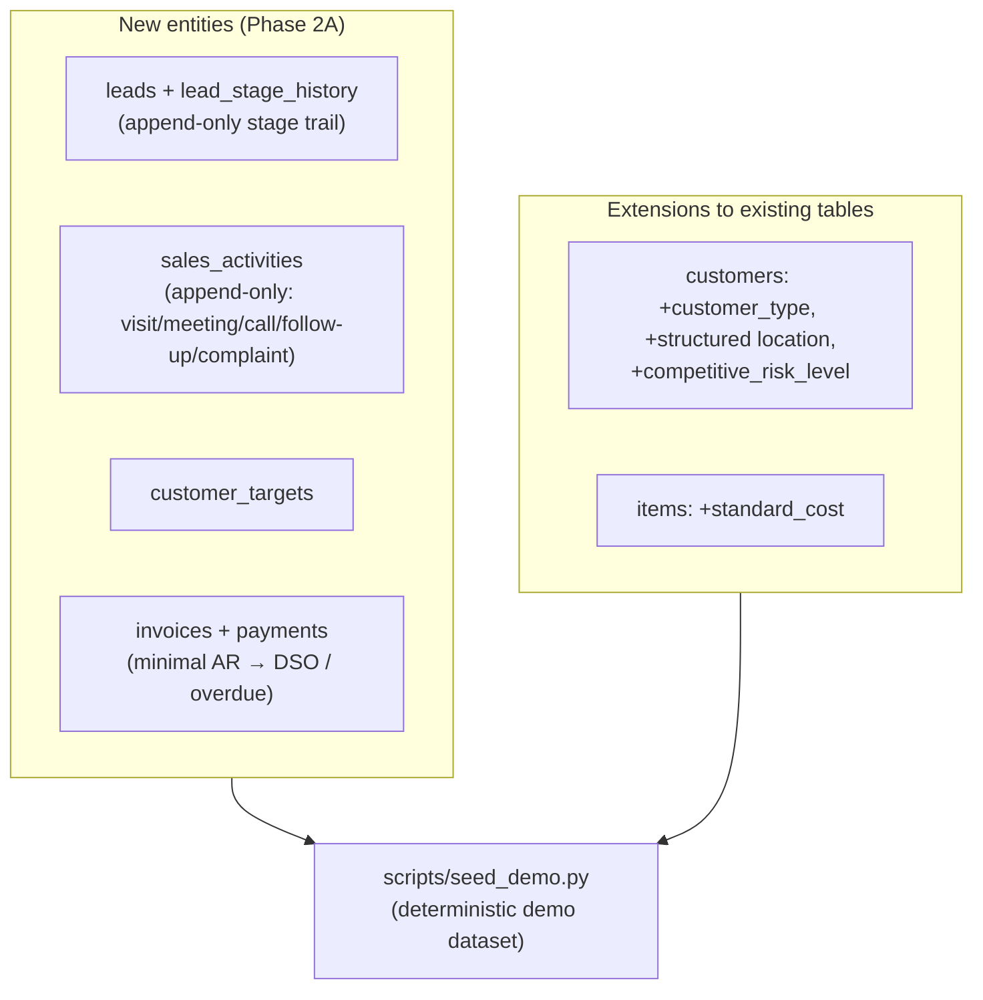
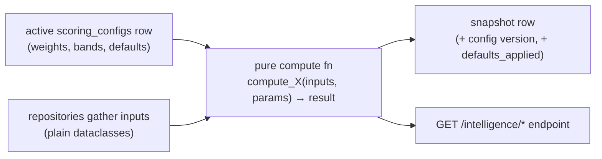
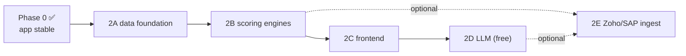

# AI Intelligence — Implementation Plan (phase-wise)

**Status:** build plan (pre-build). **Audience:** engineers implementing the
intelligence layer; reviewers gating each phase.
**Purpose:** the *how* — phase by phase, spec-first and test-first, to a
production-grade bar, without breaking the shipped Phase-1 app.

**Reads with:** `AI_Intelligence_Features.md` (the *what*),
`AI_Intelligence_Integration.md` (how it lands in the existing code + Zoho),
and `INTELLIGENCE_SPECIFICATION.md` (the formula-exact internal spec — the
authority for every band/default/config-JSON; this plan executes it).
Engineering contract: `Backend/CLAUDE.md` (spec-first + TDD) and
`Frontend/CLAUDE.md`.

---

## 0. Method — how every slice is built

This is non-negotiable and mirrors how the Phase-1 app was shipped (Backend
257 tests, Frontend 334 tests, all green):

```
spec  →  red (failing tests)  →  green (minimal impl)  →  refactor  →  verify
```

1. **Spec restate** — one paragraph + the exact bands/defaults from
   `INTELLIGENCE_SPECIFICATION.md` for the slice.
2. **Tests first** — encode the spec: canonical vectors, band edges, defaults,
   cohort edges, DB-invariant (`IntegrityError`) tests, auth/permission.
3. **Implement minimally** — only what makes the tests pass. No speculative
   fields.
4. **Refactor under green**, then **verify**: `pytest`, `ruff`, `mypy`
   (Backend); `npm run verify` + `test:coverage` (Frontend).
5. **One Alembic migration per slice.** Additive only — never mutate Phase-1
   tables destructively.
6. **Stop at each phase gate** for user testing before the next phase.

**Production-grade bar (carried from Phase 1):** typed everywhere (mypy
strict), structured logging with `request_id`, domain exceptions via the
`AppError` envelope, CHECK constraints for every invariant, append-only
ledgers, no secrets in logs, coverage thresholds enforced.

---

## 1. Architecture decisions that shape the build

| Decision | Choice | Why |
|---|---|---|
| Where intelligence lives | **Inside the existing Backend** as new modules (`services/scoring/`, new `models/`, `api/v1/`) | No 4th service, no new infra (no Redis/Celery/Kafka) at POC scale — `Backend/CLAUDE.md` §2. |
| Compute model | **Deterministic, pure functions** over stored data | Testable to the decimal; no AI cost/nondeterminism. |
| Weights & bands | **`scoring_configs` rows (JSONB)**, one active version per engine | Change a weight = data change, not deploy (ADR-001). |
| Score persistence | Lead scores: **persist on write**. Cohort scores (health/effort/beat): **live-on-read + snapshot via recompute** | Freshness without cache-invalidation machinery; trends from snapshots. |
| Recompute scheduling | **cron / Windows Task Scheduler hitting an admin endpoint** nightly | No new infra; the endpoint is synchronous and idempotent. |
| LLM (Phase 2D) | **Free OpenRouter / Groq endpoint**, temperature 0, JSON-validated, grounded | Zero cost; reproducible; never authoritative over deterministic scores. |
| Data sources | App is canonical; **Zoho/SAP ingest is a later, optional source** | Preserves the build order (Integration Layer last) and standalone determinism. |



---

## 2. Phase roadmap (at a glance)

| Phase | Theme | Output | Gate |
|---|---|---|---|
| **0** | Prerequisite | Phase-1 app stable & green | ✅ done (283 BE / 334 FE tests green) |
| **2A** | Data foundation | leads, activities, targets, invoices/payments, customer/item extensions, seed data | CRUD demoable on seeded data |
| **2B** | Scoring engines | config infra + 4 deterministic engines + recompute + snapshots | Canonical vectors verified; scores reviewed |
| **2C** | Frontend surfaces | leads, activities, health, performance, beat, dashboard widgets | User testing in browser |
| **2D** | LLM layer | AI business summary + optional qualitative lead sub-score (free LLM) | Grounding + determinism rules verified |
| **2E** | External data (optional) | Zoho activity/lead ingest + SAP/CRM-DB ETL via Integration Layer | Production data feeds verified |

> Phases 2A and 2B are the heart and are fully specified in
> `INTELLIGENCE_SPECIFICATION.md` §19 (slice-level work breakdown) and §20
> (status tracker). This document gives the executive build view and the
> production-grade concerns per phase.

---

## 3. Phase 2A — Data foundation

**Goal:** capture the data the engines need, using existing Backend
conventions (UUID PKs, audit FKs, `created_at`/`updated_at`, CHECK
constraints, append-only where it's a ledger). No scoring yet.



**Slices (each = one PR, one migration, TDD):**

| Slice | Scope | Key tests |
|---|---|---|
| 2A.1 | `customers` + `items` extensions (type, location, competitive_risk, `standard_cost`) | PATCH accepts new fields; RETAILER/NONE backfill; `CHECK standard_cost ≥ 0` via direct insert |
| 2A.2 | `leads` + `lead_stage_history`; `lead_number` generator; transition service writes history atomically | full stage-transition matrix (legal pass / illegal → 409); WON/LOST consistency CHECKs; filters |
| 2A.3 | `sales_activities` (append-only — no PATCH/DELETE) | subject-required CHECK; rep defaulting; no mutation routes |
| 2A.4 | `customer_targets` | unique-period 409; period-order 422 |
| 2A.5 | `invoices` + `payments`; number generator | OVERPAYMENT 409; due-date CHECK; outstanding/overdue derivation |
| 2A.6 | `scripts/seed_demo.py` — deterministic, guarded, acceptance-asserting | two fresh runs → identical counts; refuses 2nd run w/o `--force`; every engine band populated |

**Why a seed script is a first-class deliverable:** no realistic data → no way
to validate or demo any engine. It must be deterministic (fixed RNG seed),
refuse to run against non-empty/non-dev DBs, and assert that every
classification bucket of every engine is reachable. (Spec §18.)

**Production-grade concerns this phase:** referential integrity (FKs with the
right `ON DELETE`), CHECK constraints as the contract (not just Pydantic),
append-only discipline for facts (activities, stage history), and a migration
that backfills existing rows safely.

**Gate 2A:** all green (`pytest`/`ruff`/`mypy`); user exercises CRUD via
`/docs` on seed data.

---

## 4. Phase 2B — Scoring engines

**Goal:** the four deterministic engines, each a **pure function** plus a thin
orchestrator that gathers inputs via repositories and persists a snapshot.



**Slices:**

| Slice | Scope | Canonical test vector |
|---|---|---|
| 2B.0 | `scoring_configs` infra + seed v1×4 + validation (weights sum to 1, bands gap-free) + admin config endpoints | one-active partial index; weight-sum 422; version auto-increment |
| 2B.1 | Lead scoring engine + `lead_scores` snapshot + write-triggers | **LS-1 = 70.0 → MEDIUM**; every band edge; every default + `defaults_applied` |
| 2B.2 | Customer health engine (live GET + snapshot) | **CH-1 = 68.5 → STABLE**; normalization identity `health = raw + 100·W_R` |
| 2B.3 | Effort & efficiency engine | **EE-1 → HIGH_EFFORT_LOW_EFFICIENCY**; cohort edges (single rep, zero activity, zero won); inverted time-to-close |
| 2B.4 | Beat planning engine | **BP-1 = 68.25 → HIGH**; LDS w/ NULL district; cluster threshold; max_visits truncation |
| 2B.5 | Recompute endpoint + snapshots + nightly invocation doc | snapshots carry active `config_id`; new config version → recompute → new version on rows |

**The pure-function rule (what makes this testable without a DB):**
```python
def compute_lead_score(inputs: LeadScoringInputs, params: dict) -> LeadScoreResult: ...
```
No session, no I/O. Unit tests hit the pure function with the canonical
vectors; integration tests hit the endpoint. This is the single most important
production-grade lever: scores are provable to the decimal.

**Mandatory test classes per engine (spec §12):** canonical vector; **every
band edge** (e.g. urgency at exactly 7 and 30 days; health at 40/60/80);
**defaults** (missing input ⇒ documented default *and* listed in
`defaults_applied`); **cohort edges** (single-member cohort, zero activity,
empty quantity cohort); **config versioning** (recompute after activating a new
version stamps the new `config_id`); **append-only** (no update/delete route
exists).

**Gate 2B:** canonical vectors hand-verified against the spec; user reviews
scores over seed data via `/docs`.

---

## 5. Phase 2C — Frontend surfaces

**Goal:** expose the engines in the React app, reusing the existing design
system and primitives (Drawer, Tabs, Pager, Modal, toast, `useApiError`,
`StockChip`-style chips). Backend frozen except bug-fixes.

Feature folders (one slice each, test-first per `Frontend/CLAUDE.md`):
`features/leads` (list + HOT/MEDIUM/COLD badges + detail score panel + guarded
stage-transition modal) → `features/activities` (log modal + timeline) →
`features/customer-health` (table + CPS/CRS drawer + trend sparkline) →
`features/team-performance` (effort×efficiency scatter) → `features/beat-plan`
(ranked visit list + cluster grouping) → dashboard widgets (hot-lead count,
at-risk count, funnel).

**Carries the three non-negotiables:** request-ID on danger toasts; live
indicators where relevant; read-only audit surfaces stay read-only.

**Gate 2C:** `npm run verify` + coverage green; user testing in browser.

---

## 6. Phase 2D — LLM layer (free, grounded, additive)

**Goal:** narrative intelligence on top of the deterministic outputs — a
per-customer/lead **AI Business Summary**, and an **optional qualitative lead
sub-score** (ADR-001 allocates 15–20 pts). **Never authoritative over
deterministic scores.**

**LLM hosting — free only (your directive):**

| Concern | Choice |
|---|---|
| Provider | **OpenRouter free models** (e.g. a free `:free` chat model) **or Groq free API** (fast Llama/Mixtral). Configurable via `core/config.py` (`LLM_PROVIDER`, `LLM_MODEL`, `LLM_API_KEY`). |
| Determinism | `temperature = 0` (ADR-001 "LLM consistency"). |
| Grounding | Prompt contains **only** retrieved records (scores, trends, activity remarks, invoice posture) — no external knowledge, no hallucinated numbers. |
| Output safety | **JSON-schema-validated** response; on validation failure or timeout → graceful fallback (return deterministic data only, summary = null). |
| Cost control | Free tier; short prompts; cache the summary per entity with a TTL; rate-limit; the feature is **off by default** when no key is set. |
| Security | API key from settings/env, **never logged**; prompt/response logged at DEBUG only, with PII redaction. |
| Versioning | model + prompt-template version logged per generation; prompt templates checked into the repo. |

```mermaid
sequenceDiagram
    participant U as User
    participant API as Backend /intelligence/customer-summary
    participant DB as PostgreSQL (scores, activities, invoices)
    participant LLM as Free LLM (OpenRouter/Groq, temp 0)
    U->>API: GET summary for customer X
    API->>DB: fetch deterministic facts (health, trend, remarks, AR)
    API->>LLM: structured prompt (facts only) + JSON schema
    LLM-->>API: JSON {summary, suggested_actions}
    API->>API: validate JSON; redact; cache
    API-->>U: deterministic facts + grounded narrative
    Note over API,LLM: on timeout/invalid JSON → return facts, summary=null
```

**Gate 2D:** grounding + determinism verified (same input → same/cached
output); summary never alters a stored score; works with the key absent
(feature simply hidden).

---

## 7. Phase 2E — External data ingestion (optional, production)

**Goal:** feed the engines from real JSPL/Zoho data in production, via the
**Integration Layer** (kept last in the build order, non-breaking).

- **Zoho → sales activity & leads ingest:** field reps log Calls/Meetings/Tasks
  on Zoho mobile; the Integration Layer pulls them into `sales_activities`
  (and optionally Leads). One-way into our app; idempotent; retried.
- **SAP / CRM-DB ETL:** the JSPL "data foundation" (Sprint 1 & 2) — validated,
  unified load from SQL Server / SAP into PostgreSQL, mapping JSPL tables
  (`CRM_PROJECT_LEAD`, `CRM_VISITS`, `SLEDGER`, `STAGE_SAP_ACHIEVEMENTDATA`, …)
  → our schema. ETL with audit, validation rules, and incremental refresh.

Details, mappings, and options are in `AI_Intelligence_Integration.md` §Zoho /
§SAP. **This phase is optional for the POC** — the engines run fully on
app-native data without it.

---

## 8. Cross-cutting production concerns

| Concern | How it's handled |
|---|---|
| **Determinism / reproducibility** | Pure engine functions; canonical vectors in CI; `Date`/RNG never used inside scoring (clock passed in). |
| **Configurability** | All weights/bands in `scoring_configs`; admin endpoint validates and versions; nothing hard-coded. |
| **Auditability** | Append-only snapshots with `config_id`; append-only activity + stage history; full lineage of "why this score". |
| **Performance** | Lead scores persisted on write; cohort scores live-on-read with composite indexes `(entity_id, computed_at DESC)`; nightly recompute for trends. Watch N+1 in cohort math — batch-load per period. |
| **Observability** | Structured logs per compute (`engine`, `entity_id`, `config_version`, `defaults_applied`); recompute logs counts + duration. |
| **Security** | JWT on every endpoint; admin-only config/recompute; LLM key in settings, never logged. |
| **Data quality** | Mirrors JSPL Sprint 1&2 FR-05…FR-10: null analysis, validation rules, post-load checks — applied at ETL (2E) and via Pydantic + CHECK constraints (2A). |
| **Non-breaking** | Additive migrations only; Phase-1 tables/behaviour untouched; full Phase-1 suite must stay green at every gate. |

---

## 9. Definition of Done (per slice) & phase gates

A slice is done when **all** hold (extends `Backend/CLAUDE.md` §13):
- [ ] Spec restated from `INTELLIGENCE_SPECIFICATION.md`.
- [ ] Tests written first, now green (`pytest -q`).
- [ ] `ruff check` + `mypy src` clean.
- [ ] Canonical vector(s) / band-edge / default / cohort-edge / DB-invariant
      tests present and green.
- [ ] One Alembic migration, additive, reversible.
- [ ] `.env.example` updated if config changed (e.g. LLM keys in 2D).
- [ ] `/docs` renders new endpoints; `execution.md` + status tracker updated.
- [ ] Full Phase-1 suite still green (nothing broken).

A **phase gate** additionally requires: user testing on seeded/real data and
explicit go-ahead before the next phase (the project's phased-delivery rule).

---

## 10. Sequencing summary



Build 2A → 2B → 2C → 2D in order; 2E (external data) can slot in once 2A's
schema is the agreed landing zone. Each phase ships, stops for testing, then
proceeds — exactly as Phase 1 was delivered.

*Next: `AI_Intelligence_Integration.md` for the concrete mapping onto the
existing Backend/Frontend/Integration-Layer code and Zoho.*
