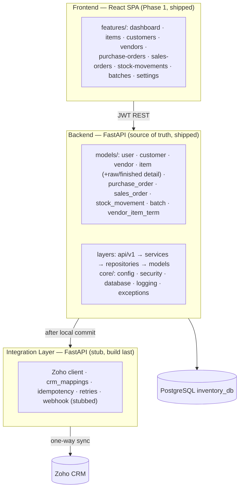
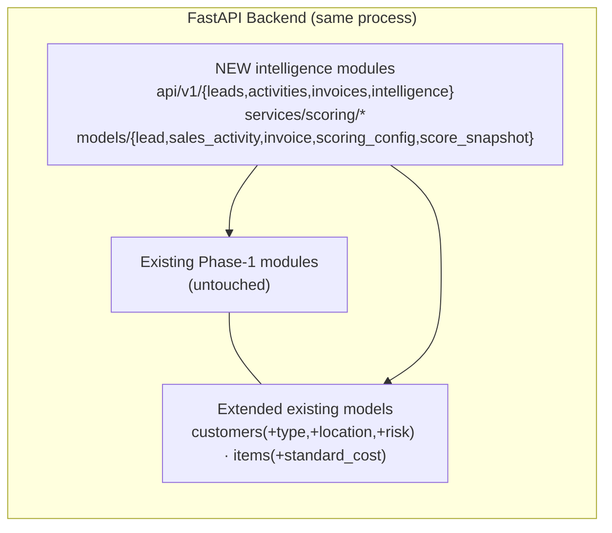
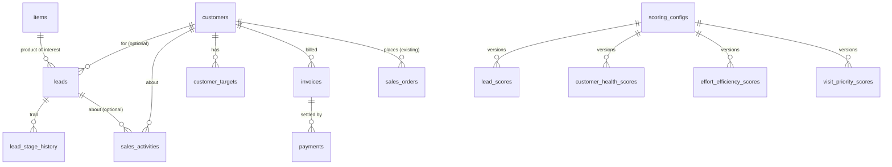
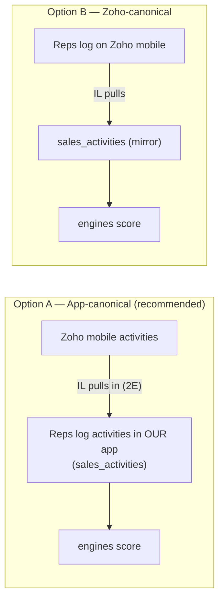
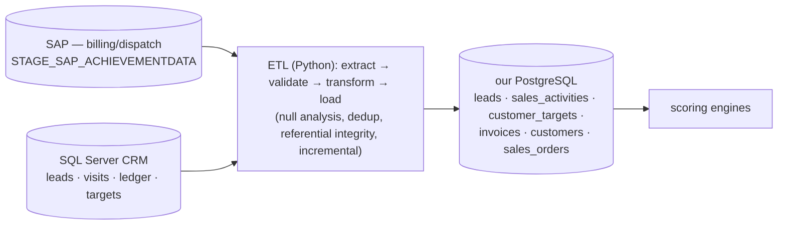

# AI Intelligence — Integration with the Existing System

**Status:** integration design (pre-build). **Audience:** engineers wiring the
intelligence layer into the shipped app; reviewers checking nothing breaks.
**Purpose:** the *where it lands* — how the four engines plug into the existing
FastAPI Backend, React Frontend, and the Zoho Integration Layer, with a
concrete data mapping and non-breaking guarantees.

**Reads with:** `AI_Intelligence_Features.md` (the *what*),
`AI_Intelligence_Implementation.md` (the phase-wise *how*),
`INTELLIGENCE_SPECIFICATION.md` (formula-exact spec),
`ZOHO_CRM_SPECIFICATION.md` (the Phase-1 Zoho contract),
`Backend/CLAUDE.md`, `Frontend/CLAUDE.md`.

---

## 1. What exists today (the integration surface)



- **Backend:** clean layered app (`api → services → repositories → models`),
  283 tests green, ruff + mypy clean. Conventions we will reuse verbatim:
  UUID PKs, server-managed `created_at/updated_at`, audit FKs
  (`created_by_user_id`/`updated_by_user_id`, `ON DELETE RESTRICT`), CHECK
  constraints as the contract, **append-only ledger** pattern
  (`stock_movements`), Alembic-per-change.
- **Frontend:** feature-first React, 334 tests green, design system + shared
  primitives (Drawer, Tabs, Pager, Modal, toast, `useApiError`, charts/chips).
- **Integration Layer:** a stub today (`CLAUDE.md`, `README.md`, `main.py`).
  Phase-1 Zoho sync is **one-way** (inventory → Zoho: Accounts, Vendors,
  Products, Sales/Purchase Orders). Leads/Deals/Activities exist in Zoho but
  are **deliberately unused** in Phase 1.
- **No intelligence code exists yet** — confirmed: `models/` has no lead /
  activity / scoring file. This is a clean, additive build.

---

## 2. Integration principle — additive, in-process, non-breaking

The intelligence layer is **new modules inside the existing Backend**, not a
new service. It reuses every existing convention and never alters Phase-1
behaviour.



**Non-breaking guarantees (enforced at every gate):**
- Additive Alembic migrations only; existing columns/tables never dropped or
  re-typed destructively; new columns are nullable or backfilled.
- The full Phase-1 test suite (283 BE / 334 FE) must stay green.
- Build order preserved: **Integration Layer stays last**; the engines run on
  app-native data with zero Zoho dependency.

---

## 3. Backend module layout — additions

New files only (everything in `Backend/CLAUDE.md` §3 is unchanged). Two new
concepts are sanctioned by `INTELLIGENCE_SPECIFICATION.md` §16 (record them in
`Backend/CLAUDE.md` when first created): the `services/scoring/` subpackage and
a `scripts/` folder.

```
Backend/
├── scripts/
│   └── seed_demo.py
└── src/app/
    ├── api/v1/      leads.py · activities.py · customer_targets.py · invoices.py · intelligence.py
    ├── models/      lead.py · sales_activity.py · customer_target.py · invoice.py ·
    │                scoring_config.py · score_snapshot.py   (+ edit customer.py, item.py)
    ├── schemas/     lead.py · sales_activity.py · customer_target.py · invoice.py · intelligence.py
    ├── services/    lead_service.py · sales_activity_service.py · customer_target_service.py ·
    │                invoice_service.py · scoring/{config,lead_scoring,customer_health,
    │                effort_efficiency,beat_planning,recompute}_service.py
    └── repositories/ lead_repo.py · sales_activity_repo.py · customer_target_repo.py ·
                      invoice_repo.py · scoring_config_repo.py · score_snapshot_repo.py
```

Frontend mirrors this with new feature folders (`features/leads`,
`activities`, `customer-health`, `team-performance`, `beat-plan`) plus
dashboard widgets — reusing existing primitives.

---

## 4. Data mapping — JSPL concepts → our schema → existing tables

The JSPL production DB is large (SQL Server: `CRM_PROJECT_LEAD`, `CRM_VISITS`,
`SLEDGER`, `STAGE_SAP_ACHIEVEMENTDATA`, `CRM_CUSTOMERLEDGER`, …). Our POC
implements a **focused, normalised subset** that the engines actually need,
landing on our existing tables where possible.

| JSPL concept (source) | Our schema (new/extended) | Reuses existing? |
|---|---|---|
| `CRM_PROJECT_LEAD` (+stage, source, geo, qty, budget) | **`leads`** + **`lead_stage_history`** (append-only) | FK → `customers`, `items`, `users` |
| `CRM_VISITS` / `CRM_VISITS_FOLLOWUP` (visits, MOM, follow-ups) | **`sales_activities`** (VISIT/MEETING/CALL/FOLLOW_UP/COMPLAINT, append-only) | FK → `customers`, `leads`, `users` |
| `SLEDGER` / `SLTYPE` (customer master, type, geo) | **`customers`** + new `customer_type`, structured location, `competitive_risk_level` | **extends existing `customers`** |
| `ILEDGER` (product master, MRP) | **`items`** + new `standard_cost` | **extends existing `items`** |
| `STAGE_SAP_ACHIEVEMENTDATA` / dispatch (sales actuals) | **`sales_orders` + `sales_order_items`** (SHIPPED = dispatch) | **reuses existing orders** |
| `CRM_MONTHLY_DEALERWISE_TARGET` / `SLEDGERTARGETACH` | **`customer_targets`** | FK → `customers` |
| `CRM_CUSTOMERLEDGER` / `CRM_PENDINGINVOICE` / cleared (AR, DSO) | **`invoices` + `payments`** (minimal AR) | FK → `customers`, `sales_orders` |
| `BEATPLAN` / `BEATPLANVISIT` | computed beat from `sales_activities` + `customers` (no new table in POC) | reuses activities + customers |
| AI output (`AIML_*`, scores) | **`scoring_configs`** + 4 **score-snapshot** tables | new, append-only |

**Key reuse:** "dispatch / sales volume" for Customer Health = **shipped
`sales_order_items.quantity`** — we already own the order + stock-movement
ledger from Phase 1, so the health engine's volume signals come from real data
the app already has.



---

## 5. How each engine reads existing + new data

| Engine | Existing tables used | New tables used |
|---|---|---|
| Lead scoring | `items` (`unit_price`, `standard_cost`), `customers` (location) | `leads` |
| Effort & efficiency | `users` (reps), `sales_orders` (won value/revenue) | `leads`, `lead_stage_history`, `sales_activities` |
| Customer health | `sales_orders`/`sales_order_items` (dispatch, margin, growth), `customers` | `customer_targets`, `invoices`+`payments`, `sales_activities` |
| Beat planning | `customers` (type, district), `sales_orders` (revenue) | `sales_activities` (visit recency) |

This is the payoff of building intelligence *inside* the app: three of four
engines draw substantial signal from **Phase-1 data we already trust**
(orders, items, customers, the stock ledger), with new tables only for the
genuinely missing inputs (leads, activities, targets, AR).

---

## 6. Frontend integration

- **New feature folders** under `Frontend/src/features/` (`leads`,
  `activities`, `customer-health`, `team-performance`, `beat-plan`), each with
  its own `api/`, `components/`, `hooks/`, `pages/` — the established
  feature-first pattern.
- **Reuse, don't reinvent:** Drawer/Tabs/Pager/Modal/EmptyState/Skeleton,
  toast + `useApiError` (request-ID on danger toasts — the §5.6
  non-negotiable), the chart/chip primitives, and the one axios instance.
- **Dashboard additions** plug into the existing dashboard: hot-lead count,
  at-risk-customer count, lead funnel widget — alongside the current KPIs.
- **Routing/nav:** new sidebar entries; `app/routes.ts` extended; protected
  routes as today.

---

## 7. Zoho / Integration Layer — sales tracking (your "we might use Zoho")

Today's Zoho contract (`ZOHO_CRM_SPECIFICATION.md`): **one-way**
inventory → Zoho (Accounts, Vendors, Products, SO, PO); Leads/Deals/Activities
are available in Zoho but unused. Zoho is the **relationship & activity layer**
and already supports Tasks/Calls/Meetings/Notes on Accounts, plus a mobile app
for field reps.

That makes Zoho a natural **sales-tracking source** for the engines'
activity-hungry signals (effort, engagement, visit-gap, communication-gap).
Two integration options:



| | Option A — app canonical *(recommended)* | Option B — Zoho canonical |
|---|---|---|
| Activity entry | Our app (+ optional Zoho ingest) | Zoho mobile |
| Scoring works standalone? | ✅ yes (deterministic, no Zoho dependency) | ❌ depends on Zoho sync |
| Honours current build order | ✅ (Integration Layer stays last/optional) | ⚠️ makes Zoho a hard dependency |
| Field-rep convenience | good (web; Zoho mobile too) | best (native mobile) |

**Recommendation — Option A.** Our app owns the canonical `sales_activities`
store so the engines are deterministic and standalone; the **Integration Layer
(Phase 2E)** optionally pulls Zoho Activities (and, if desired, Leads) **into**
`sales_activities`/`leads`, idempotently and one-way, exactly like the existing
sync mechanics (`crm_mappings`, `Idempotency-Key`, retries, `sync_logs`). This:
- keeps the engines runnable today with zero external dependency,
- lets field reps keep using Zoho mobile in production (their activity flows
  into scoring),
- requires **no change** to the Phase-1 one-way contract — it adds a new
  one-way *ingest* path, leaving inventory state app-owned.

**New Integration-Layer responsibilities (Phase 2E, additive):**
- `Zoho Activities (Calls/Meetings/Tasks) → sales_activities` (one-way ingest).
- *(optional)* `Zoho Leads ↔ leads` — start one-way Zoho→app; bidirectional is
  a later, explicit decision (today `ZOHO_CRM_SPECIFICATION.md` excludes Leads).
- Reuse existing idempotency, mapping, retry, and `sync_logs` patterns.

---

## 8. SAP / CRM-DB ingestion (production data foundation, Phase 2E)

For a real JSPL deployment, the engines feed from the existing operational
data via the JSPL "data foundation" (Sprint 1 & 2): a validated, unified ETL
from SQL Server / SAP into PostgreSQL.



ETL maps JSPL tables → our schema (§4), applies the JSPL validation rules
(FR-05…FR-10: counts, nulls, ranges, dedup, post-load checks), and runs
incrementally. **Optional for the POC** — the seed script (`seed_demo.py`)
substitutes for it during development and demos.

---

## 9. Known data-readiness gaps & how integration handles them

From the document analysis, several JSPL inputs aren't cleanly available. None
block the build; each has a config-driven or manual mitigation:

| Gap | Where it bites | Mitigation in our integration |
|---|---|---|
| **Area-MRP master** (beat revenue) | Beat planning revenue score | Use 90-day shipped-order revenue from existing `sales_orders`; Area-MRP optional later. |
| **Competitor data** (price/migration) | Customer-health competitive risk | Manual `competitive_risk_level` enum on `customers` for the POC; LLM extraction from remarks in 2D. |
| **W_P / W_R calibration** | Customer health | Config defaults (0.60/0.40); admin can set per profile. |
| **Lead-score budget tiers / normalisation period** | Lead scoring | Config defaults in `scoring_configs` v1 **[confirm with business]**. |
| **`standard_cost`** (margins) | Lead + health margin | Nullable column; missing ⇒ documented default score (no crash). |
| **Calls not in CRM** | Effort score | Our app owns its CRM; `CALL` is a first-class `ActivityType` from day one. |

---

## 10. Integration test & safety checklist

- [ ] Every new migration is additive and reversible; Phase-1 schema intact.
- [ ] Full Phase-1 suite (283 BE / 334 FE) green after each slice.
- [ ] New endpoints JWT-protected; admin-only on config/recompute.
- [ ] DB-invariant tests (direct insert → `IntegrityError`) for every new CHECK.
- [ ] Engines run with **no Zoho/SAP connection** (standalone determinism).
- [ ] Zoho ingest (2E) is one-way, idempotent, and never mutates inventory
      state; failures land in `sync_logs`, never roll back local data.
- [ ] LLM (2D) key absent ⇒ feature hidden; present ⇒ grounded, temp 0,
      JSON-validated; never alters a stored score.

---

## 11. Summary — can we start the AI Intelligence integration?

**Yes.** The Phase-1 app is stable and green, the integration is purely
additive, and the design is already specified to the formula level
(`INTELLIGENCE_SPECIFICATION.md`). The recommended path:

1. **Phase 2A** — build the data foundation (leads, activities, targets,
   invoices/payments, customer/item extensions) + deterministic seed script.
2. **Phase 2B** — the four deterministic engines, config-driven and
   snapshot-audited, proven against canonical vectors.
3. **Phase 2C** — frontend surfaces on the existing design system.
4. **Phase 2D** — free-LLM narrative layer (OpenRouter/Groq), grounded and
   additive.
5. **Phase 2E (optional/production)** — Zoho activity/lead ingest + SAP/CRM-DB
   ETL via the Integration Layer, for real sales-tracking data.

Everything honours the existing engineering bar (spec-first, TDD,
production-grade) and the build order (Integration Layer last), and nothing in
Phase 1 is put at risk.
